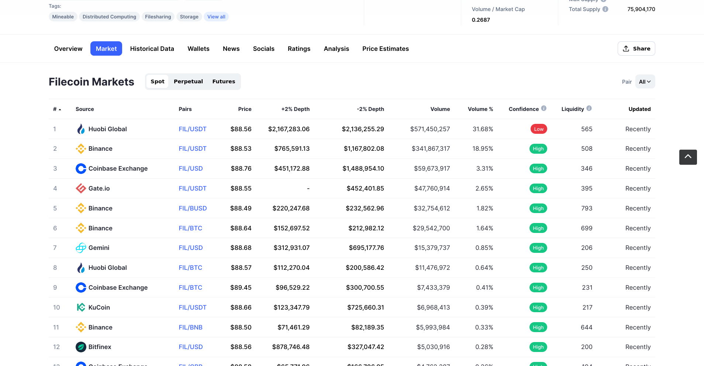

# {{ $frontmatter.title }}

{{ $frontmatter.description }}

## 钱包

钱包允许您管理您的资产，而无需直接处理 Filecoin 节点。

:::danger 未经审计的钱包
使用未经审计的钱包时要格外小心。 _已经_通过审计的钱包已由公认的安全公司检查其代码库是否存在安全漏洞和潜在泄漏。
:::

| 名称                                           | 描述                                                                                                                          | 审计 |
| ---------------------------------------------- | ------------------------------------------------------------------------------------------------------------------------------------ | ------- |
| [Glif web wallet](https://wallet.glif.io/?network=f)                                | 支持发送和接收 FIL。可以与 Ledger 硬件设备集成。                                                   | Yes     |
| FilSnap MetaMask plugin                        | MetaMask 有一个名为的插件系统 [Snaps](https://github.com/MetaMask/metamask-snaps-beta/wiki). 该系统目前处于测试阶段. | No      |
| [Filfox wallet](https://wallet.filfox.info/en) | 基于浏览器的钱包。                                                                                                              | 未知 |
| [ImToken](https://token.im/)                   | 多币种钱包。                                                                                                            | 未知 |
| [MathWallet](https://mathwallet.org/en-us/)    | 多币种钱包。                                                                                                             | 未知 |
| [Trust wallet](https://trustwallet.com/)                                   | 多币种钱包。这是币安的官方钱包。                                                                    | 未知 |

## 交流

加密货币交易所，或简称为_exchange_，是一种服务，可让您将现金换成加密货币、加密货币换成现金，甚至一种加密货币换成另一种加密货币。它们的工作方式类似于您在机场找到的货币兑换处，在那里您可以将本国货币兑换为您要去的国家之一。如果您之前购买过加密货币，那么您之前可能已经使用过交易所。

有许多交易所允许用户购买、出售和交易 FIL。 [coinmarketcap.com](https:coinmarketcap.comcurrenciesfilecoinmarkets) 等网站会跟踪哪些交易所支持哪些加密货币。您可以使用这些列表来帮助决定使用哪个交易所。

找到要使用的交易所后，您必须在该交易所创建一个帐户。许多更改都有严格的验证和了解您的客户 (KYC) 流程，因此创建您的帐户可能需要几天时间。但是，大多数大型交易所可以在几分钟内验证您的信息。

购买加密货币因交易所而异，但过程通常是这样的：

1. 以您的当地货币（美元、欧元、日元等）向您的兑换账户充值。
1. 以固定价格将您的当地货币兑换为 FIL。

### 从您的交易所发送 FIL

在您的交换帐户中拥有 FIL 后，您应该能够将一些发送到您使用 Lotus 节点创建的公共地址。同样，每个交易所的流程都不同，但总的来说，它是这样的：

1. 向交易所提交提款请求，包括：
    - 您想提取多少 FIL。
    - 您希望将 FIL 发送到何处。该值应该是您使用 Lotus 节点创建的公共地址 `f16mwi...`。
1. 等待提款完成.

一些交易所对您一次可以提取的金额设置了限制。交易所也可能对您的提款设置时间锁定。

您的 FIL 可能需要几分钟才能显示在您的 Lotus 地址中。如果从交易所提款完成 30 分钟后，您在 Lotus 地址中没有看到 FIL，请联系交易所的支持团队寻求帮助。

## Filecoin 的面额

就像一美分代表一美元的一小部分一样，有很多方法可以使用 Filecoin 来表示价值。这是因为 Filecoin 网络上的某些操作所需的价值远小于 1 个完整的“FIL”。 `FIL` 的不同面额是：

| 名称     | 数值             |
| -------- | ------------------- |
| FIL      | 1                   |
| milliFIL | 1000                |
| microFIL | 1000000             |
| nanoFIL  | 1000000000          |
| picoFIL  | 1000000000000       |
| femtoFIL | 1000000000000000    |
| attoFIL  | 1000000000000000000 |
