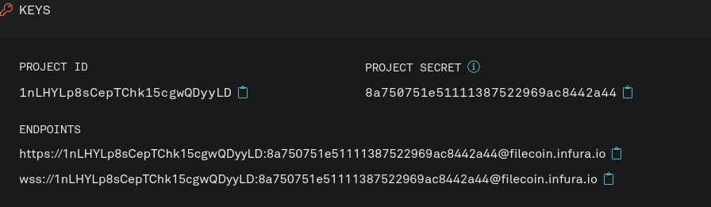

# {{ $frontmatter.title }}

{{ $frontmatter.description }} Infura API 通过抽象掉一些复杂的工作流程和要求，使其更容易与 Filecoin 网络进行交互。不需要旋转节点或直接调用 Lotus 守护进程!

:::warning
Infura API 要求所有用户都要注册到等待名单中才能访问API。注册过程很简单，大多数用户在几分钟内就可以访问 API。您需要访问该 API 才能完成本教程。 Infura 计划在未来几周内取消候补名单流程。
:::

在本教程中，你将:

1. 登录到Infura API。
1. 创建一个Node.js脚本来。
   a. 检查给定的字符串是否是有效的 Filecoin 地址。
   a. 如果有效，返回该地址的余额。
1. 发现更多使用 Infura API 与 Filecoin 网络交互的方法。


## 先决条件

确保你同时安装了 [Node.js](https://nodejs.org/) 和 [NPM](https://www.npmjs.com/) 。

## Infura API

要与 Infura API 互动，您需要在 Infura 网站上注册。这是一个免费的 API ，您需要做的就是用您的电子邮件注册。

1. 前往[infura.io/](https://infura.io/) 并登录。
1. 从侧边栏选择**Filecoin**，然后点击**Create new project**。
1. 输入 _Filecoin - Get started_ 作为项目名称并点击**Create**.
1. 您现在应该看到您的 `Project ID` 和 `Project Secret`. 记下这两个字段，我们稍后会用到它们。



这就是 Infura 方面的一切设置。接下来，让我们创建我们的项目。

## 创建你的项目

为了让管理更容易一些，让我们为我们的项目创建一个新的目录，并创建一个带有一些模板代码的文件：

1. 为了开始工作，创建一个新的项目目录并移入其中：

   ```bash
   mkdir ~/Code/filecoin-wallet-checker -p
   cd ~/Code/filecoin-wallet-checker
   ```

1. 创建一个名为 `index.js` 的文件，并添加以下模板代码：

   ```javascript
   let request = require('request')

   // Call the Infura API and check that the address is valid.

   request(options, (error, response, body) => {
     if (error) {
       console.error('Error: ', error)
     } else {
       console.log('Response: ', body)
     }
   })
   ```

1. 将 `request` 包添加到本项目中：

```bash
npm install request

> ...
> + request@2.88.2
> added 47 packages from 58 contributors and audited 47 packages in 1.594s
> ...
```

现在我们已经建立了一个项目，我们可以开始建立我们的脚本了!

## 设计基本脚本

我们已经设置好了项目目录，并准备好了 `index.js` 文件。让我们开始通过创建一个基本的API调用来充实我们的脚本：

1. 提醒一下，这就是我们的模板代码的样子：

   ```javascript
   let request = require('request')

   // Call the Infura API and check that the address is valid.

   request(options, (error, response, body) => {
     if (error) {
       console.error('Error: ', error)
     } else {
       console.log('Response: ', body)
     }
   })
   ```

1. 在注释下面创建一个名为 `options` 的对象。这个对象就是我们要建立请求的地方：

   ```javascript
   // Call the Infura API and check that the address is valid.
   let options = {}
   ```

1. 在对象中输入 `url`、`method` 和 `headers` 值:

   ```javascript
   // Call the Infura API and check that the address is valid.
   let options = {
     url: 'https://filecoin.infura.io',
     method: 'post',
     headers: {
       'content-type': 'application/json'
     }
   }
   ```

   这些都是非常自明的，所以我们在这里就不深究它们的含义了。我们比较感兴趣的两个对象值是 `body` 和 `auth`:

1. 创建一个名为 `auth` 的新值，并在其中创建一个新对象：

   ```javascript
   // Call the Infura API and check that the address is valid.
   let options = {
     url: 'https://filecoin.infura.io',
     method: 'post',
     headers: {
       'content-type': 'application/json'
     },
     auth: {}
   }
   ```

   这个对象是Infura API用来验证您的请求的。

1. 在 `user` 和 `pass` 字段中添加您的 Infura项目ID和项目密码：

   ```javascript
   // Call the Infura API and check that the address is valid.
   let options = {
     url: 'https://filecoin.infura.io',
     method: 'post',
     headers: {
       'content-type': 'application/json'
     },
     auth: {
       user: '1nO7B...',
       pass: 'bda4a...'
     }
   }
   ```

   在 `user` 栏中输入您的项目ID，在 `pass` 栏中输入您的项目密码。您可以通过进入`infura.io/dashboard/filecoin`，选择您的项目，并进入**设置**选项卡，找到您的 Infura 详细信息。

1. 我们需要添加到`options`对象的最后一个值是我们请求的`body`。`body`对象定义了API端点使用的ID，要使用的JSON版本，以及你要调用的方法。设置`id`为`0`，`jsonrpc`为`2.0`：

   ```javascript
   // Call the Infura API and check that the address is valid.
   let options = {
     url: 'https://filecoin.infura.io',
     method: 'post',
     headers: {
       'content-type': 'application/json'
     },
     auth: {
       user: '1nO7B...',
       pass: 'bda4a...'
     },
     body: `{
         "jsonrpc": "2.0", 
         "id": 0
    }`
   }
   ```

   确保使用反标 `` ` `` ，因为它们让我们把`body`对象跨过几行。这在功能上没有任何作用，但它使我们的代码相当整洁。

1. 将 "方法 "设置为 "Filecoin.ChainHead"：

   ```javascript
   // Call the Infura API and check that the address is valid.
   let options = {
     url: 'https://filecoin.infura.io',
     method: 'post',
     headers: {
       'content-type': 'application/json'
     },
     auth: {
       user: '1nO7B...',
       pass: 'bda4a...'
     },
     body: `{
         "jsonrpc": "2.0", 
         "id": 0, 
         "method": "Filecoin.ChainHead"
     }`
   }
   ```

   方法`Filecoin.ChainHead`返回当前链的头部。虽然这不是我们要使用的最终方法，但它是测试我们的脚本是否有效的好方法。

## 测试运行

我们的脚本中已经有了一些基本的功能，所以我们应该运行所有的东西，以确保它的所有工作！

1. 在你的项目目录下，使用`node`调用脚本：

```bash
node index.js

> Post successful: response:  {"jsonrpc":"2.0","result":{"Cids":[{"/":"bafy2bzaceamdit67mnlyozufeaptmhmti6dv ...
```

非常好！Infura API 收到了我们的请求，并给我们发回了最新的链头信息，它给我们发回了最新的链头信息。但我们对链头不感兴趣，我们想得到的是关于地址的信息！

## 验证地址

我们不问链头信息，而是看看给定的字符串是否是有效的 Filecoin 地址：

1. 在`options`对象的`body`部分，将`method`从`Filecoin.ChainHead`改为`Filecoin.WalletValidateAddress`。

   ```javascript
   // Call the Infura API and check that the address is valid.
   let options = {
     url: 'https://filecoin.infura.io',
     method: 'post',
     headers: {
       'content-type': 'application/json'
     },
     auth: {
       user: '1nO7B...',
       pass: 'bda4a...'
     },
     body: `{
         "jsonrpc": "2.0",
         "id": 0,
         "method": "Filecoin.WalletValidateAddress"
     }`
   }
   ```

   如果我们现在运行这个脚本，我们会从 Infura API 得到一个错误，因为 `WalletValidateAddress` 方法需要至少一个字符串作为参数。你可以在 [Infura Filecoin API文档](https://infura.io/docs/filecoin) 上找到更多关于可用的方法及其要求的信息。

1. 在 `body` 对象中添加一个名为 `params` 的数组:

   ```javascript
   // Call the Infura API and check that the address is valid.
   let options = {
     url: 'https://filecoin.infura.io',
     method: 'post',
     headers: {
       'content-type': 'application/json'
     },
     auth: {
       user: '1nO7B...',
       pass: 'bda4a...'
     },
     body: `{
         "jsonrpc": "2.0",
         "id": 0,
         "method": "Filecoin.WalletValidateAddress",
         "params": [""],
     }`
   }
   ```

1. 在 `params` 数组里面，添加一个你要检查的地址：

   ```javascript
   // Call the Infura API and check that the address is valid.
   let options = {
     url: 'https://filecoin.infura.io',
     method: 'post',
     headers: {
       'content-type': 'application/json'
     },
     auth: {
       user: '1nO7B...',
       pass: 'bda4a...'
     },
     body: `{
         "jsonrpc": "2.0",
         "id": 0,
         "method": "Filecoin.WalletValidateAddress",
         "params": ["f1ydrwynitbbfs5ckb7c3qna5cu25la2agmapkchi"],
     }`
   }
   ```

   这个例子使用`f1ydrwynitbbfs5ckb7c3qna5cu25la2agmapkchi`作为`params`字段的地址。

1. 让我们重新运行这个脚本，看看有什么反应：

   ```bash
   node index.js

   > Response:  {"jsonrpc":"2.0","result":"f1ydrwynitbbfs5ckb7c3qna5cu25la2agmapkchi","id":0}
   ```

   太好了！事实上，我们在 "结果 "字段中得到了我们的地址，这意味着我们的地址是有效的。如果我们发送了一个无效的地址，我们会得到这样的结果：

   ```bash
   Response:  {"jsonrpc":"2.0","id":0,"error":{"code":1,"message":"invalid address payload"}}
   ```

## 检查余额

我们的脚本检查给定的字符串是否是一个有效的Filecoin地址，但并没有做其他的事情。让我们让脚本告诉我们一个给定的Filecoin地址的余额是多少：

1. 我们唯一要做的改变就是从 Infura API 中请求`WalletBalance`方法。

   ```javascript
   // Call the Infura API and check that the address is valid.
   let options = {
     url: 'https://filecoin.infura.io',
     method: 'post',
     headers: {
       'content-type': 'application/json'
     },
     auth: {
       user: '1nO7B...',
       pass: 'bda4a...'
     },
     body: `{
         "jsonrpc": "2.0", 
         "id": 0, 
         "method": "Filecoin.WalletBalance", 
         "params": ["f1ydrwynitbbfs5ckb7c3qna5cu25la2agmapkchi"]}`
   }
   ```

1. Infura API会让我们知道余额：

   ```bash
   node index.js

   > ADDRESS:  {"jsonrpc":"2.0","result":"7182015146934547358774","id":0}
   ```

   Infura API返回`attoFIL`中地址的值。如果您请求的地址没有余额，Infura的响应将是空白。

## 到目前为止的脚本

这是目前你的脚本应该是什么样子的：

```javascript
let request = require('request')

// Call the Infura API and check that the address is valid.
let options = {
  url: 'https://filecoin.infura.io',
  method: 'post',
  headers: {
    'content-type': 'application/json'
  },
  auth: {
    user: '1nO7B...',
    pass: 'bda4a...'
  },
  body: `{
      "jsonrpc": "2.0",
      "id": 0,
      "method": "Filecoin.WalletBalance",
      "params": ["f3tfhgkbq6h55fqhumadd7wvogx3bbhgm3ifg6mk6hq35ob3fex2uei7hfbo2nwqkzudjzjidmshxpvo3ja4iq"]
  }`
}

request(options, (error, response, body) => {
  if (error) {
    console.error('Error: ', error)
  } else {
    console.log('Response: ', body)
  }
})
```

## 下一步

我们只是真正的了解了一下你能用这个 API 做什么。 [Infura文档](https://infura.io/docs/filecoin) 是一个很好的资源，可以帮助你确定你可以构建什么。为什么不尝试使用 API 在两个账户之间生成一个交易并发送 `FIL` ？或者获取某个miner的信息？
