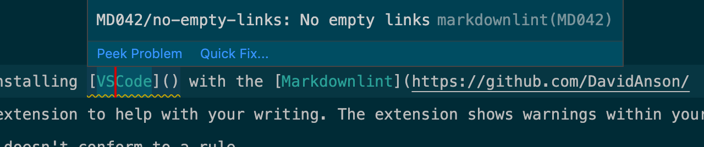
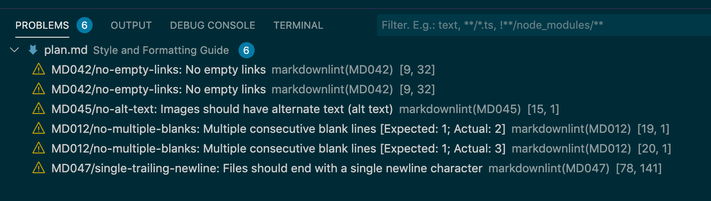

# 语法、格式和样式

本页详细介绍了编写 Filecoin 文档的语法和格式规则。关于写作的更多概念，请查阅 [writing guide](./writing-guide.md).

## 语法和拼写

以下是 Filecoin 文档遵循的一些特定于语言的规则。如果你使用像[Grammarly](https://www.grammarly.com/), 这些规则中的大多数在默认情况下处于启用状态。

### 美式英语

虽然 Filecoin 是一个全球性的项目，但事实是美式英语是当今最常用的英语。有鉴于此，在为 Filecoin 项目编写内容时，请使用美式英语拼写。把其他语体的英语转换成美式英语的基本规则是：

1. 把“s”换成“z”，比如“categorize”和“pluralize”。
2. 从单词里去掉`u` 像 "color"和 “honor”.
3. 用“tre”替换“ter”，比如“center”。

### 牛津逗号

在包含三个或三个以上项目的列表中，除最后一个项目外，每个项目后面都要有一个逗号“，”：

| Use                           | Don't use                    |
| ----------------------------- | ---------------------------- |
| One, two, three, and four.    | One, two, three and four.    |
| Henry, Elizabeth, and George. | Henry, Elizabeth and George. |

### 对 Filecoin 的引用

作为一个专有名词，“Filecoin”（大写）仅用于指代总体项目、协议或项目的规范网络：

> Filecoin [the project] has attracted contributors from around the globe!

> Filecoin [the protocol] rewards contributions of data storage instead of computation!

> Filecoin [the network] is currently storing 50 PiB of data!

这个名字也可用作形容词:

> The Filecoin ecosystem is thriving!

> I love contributing to Filecoin documentation!

当提到用作 Filecoin 货币的代币时，首选名称“FIL”；也可以用 Unicode 符号表示带有双划（⨎）的整数。这些符号可以用作后缀或前缀，视情况而定：

- Unit prefix: **100 FIL**.
- Unit suffix: **FIL 100**.
- Symbol prefix: **⨎100**.
- Symbol suffix: **100 ⨎**.

FIL 最小和最常见的面额是“attoFIL”（10^-18 FIL）。

> The collateral for this storage deal is five FIL.

> I generated ⨎100 as a storage miner last month!

> My wallet has thirty filecoin.

不鼓励使用的示例：

> Filecoin rewards miners with Filecoin.

> There are many ways to participate in the filecoin community.

> My wallet has thirty filecoins.

这些术语使用的一致性有助于保持这些不同概念的不同。

### Lotus 的引用

Lotus 是 Filecoin 的主要实现。因此，它经常在 Filecoin 文档中被引用。在引用 Lotus 实现时，使用大写的 _L_ 。小写 _l_ 应该只在引用`lotus daemon`等 Lotus 可执行命令时使用。Lotus 可执行命令应该总是在代码块中:

````markdown
1. 启动 Lotus 守护进程:

   ```bash
   lotus daemon
   ```

2.在你的 Lotus 守护进程运行几分钟后，使用`lotus`检查它连接到 Filecoin 网络中的其他节点的数量:

```bash
lotus net peers
```
````

Lotus Miner 遵循同样的规则。引用应用程序时，_L_ 和 _M_ 要大写，引用可执行命令时，在代码块中使用小写字母:

````markdown
现在可以启动 Lotus Miner 了:

```markdown
lotus-miner run
```
````

### 缩略语

如果必须使用首字母缩略词，请先拼写完整的短语，并在第一次在每个文档中使用时将其括在括号“（）”中。例外情况：对于常见的首字母缩略词，如“IPFS”通常不需要这样做，除非是为一篇独立的文章撰写的，该文章可能不会与项目文档一起呈现。

> Virtual Machine (VM), Decentralized Web (DWeb).

## 格式化

降价语法的外观，以及要遵循的代码格式规则。

### 语法

Filecoin Docs 项目遵循 GitHub 风格的降价语法。这样，所有文章都可以在 GitHub 中正确显示。这使读者可以在 [the docs website](https://docs.filecoin.io) 上查看文章或 [其 GitHub 回购](https://github.com/filecoin-project/filecoin-docs).

### 规则

我们使用 [VSCode 标记下行链路](https://github.com/DavidAnson/vscode-markdownlint)中列出的规则扩展. 您可以将这些规则导入任何文本编辑器，如 Vim 或 Sublime。所有规则都会列出 [在 markdownlent 存储库中](https://github.com/DavidAnson/markdownlint/blob/master/doc/Rules.md).

我们强烈建议安装 [VSCode](https://code.visualstudio.com/) 用 [Markdownlint](https://github.com/DavidAnson/vscode-markdownlint) 扩展来帮助你写作。每当您的副本不符合规则时，扩展名会在您的标记中显示警告。



扩展名汇总编辑器底部打开文件中的所有警告：



## 风格

以下规则解释了我们如何组织和组织我们的写作。此处列出的规则是对 [规则](https://github.com/DavidAnson/markdownlint/blob/master/doc/Rules.md)的补充在[Markdownlinter 延伸](https://github.com/DavidAnson/vscode-markdownlint)中找到.

### 文本

以下规则适用于编辑和设置文本样式。

#### 标题

1 所有标题都遵循句子结构。只有“姓名”和“地点”与标题的第一个字母一起大写。所有其他字母均为小写：

```markdown
## This is a title

### Only capitalize names and places

#### The capital city of France is Paris
```

2. 每篇文章都以一个标题和描述开头：

   ```markdown
   ---
   title: Example article
   description: This is a brief description that shows up in link teasers in services like Twitter and Slack.
   ---

   ## This is a subtitle

   Example body text.
   ```

在上面的示例中，“title:”用作“<h1>”或“#`标记。每篇文章中只有一个此级别的标题。

3. 标题不包含标点符号。如果您在标题中有问题，请将其改为陈述：

   ```markdown
   <!-- This title is wrong. -->

   ## What is Filecoin?

   <!-- This title is better. -->

   ## Filecoin explained
   ```

#### 粗体文本

双星号“**”用于定义**粗体\*\*文本。当阅读器必须与显示为文本的内容交互时，请使用粗体文本：按钮、超链接、包含文本的图像、窗口名称和图标。

```markdown
In the **Login** window, enter your email into the **Username** field and click **Sign in**.
```

#### 斜体字

下划线 `_` 设置除输入字段或按钮外的内容名称的斜体样式:

```markdown
Here are some American things:

- The _Spirit of St Louis_.
- The _White House_.
- The United States _Declaration of Independence_.

Try entering them into the **American** field and clicking **Accept**.
```

引用文本的引号或部分采用斜体样式，并用双引号 `"`:

```markdown
In the wise words of Winnie the Pooh _"People say nothing is impossible, but I do nothing every day."_
```

#### 代码块

标记代码块及其所呈现核心的语法：

````markdown
    ```javascript
    console.log(error);
    ```
````

##### 命令行示例

该项目支持一个特殊的 `with-output` 标签，可以应用于 Markdown 代码块以支持命令行示例。
当您将 `with-output` 添加到代码块时，紧随其后的代码块将被设置为“output”块的样式。这个
让读者轻松区分输入和输出，并允许他们使用以下命令仅将输入部分复制到剪贴板 按钮.

请注意，您必须包含语言标签 (例如, `shell`, 或 `bash`) 以及 `with-output` 标签, 并且输出代码块必须紧跟在输入块之后.

这是一个使用 `with-output` 标签的例子:

````markdown
    ```shell with-output
    lotus-miner info
    ```
    ```
    Miner: t0103
    Sector Size: 16.0 MiB
    Power: 0 B / 16.0 MiB (0%)
    Worker use:
        Local: 0 / 2 (+1 reserved)
        **Remote: 0 / 1**
    PoSt Submissions: Not Proving
    Sectors:  map[Committing:0 Proving:0 Total:0]
    ```
````

命令行示例可以用三个句点“…”截断，以删除无关信息：

````markdown
    ```shell with-output
    lotus-miner info
    ```
    ```
    Miner: t0103
    Sector Size: 16.0 MiB
    ...
    Sectors:  map[Committing:0 Proving:0 Total:0]
    ```
````

如果你的命令行输出没有直接“绑定”到相应的输入块，你可以使用 `output` 标签来获取
与 `with-output` 块类似的视觉样式。当您想在输入和输出块之间添加一些解释性文本时，这会很有用：

````markdown
  ```shell with-output
  some-shell-command
  ```

  这是一些解释输出的文本...

  ```text output
  The command output...
  ```
````

请注意，您必须有语言提示（例如`text`）和`output`标签才能正确应用样式.

#### 内联代码标记

将目录、文件名和版本号环绕在内联代码标记“```”之间。

```markdown
Version `1.2.0` of the program is stored in `~/code/examples`. Open `exporter.exe` to run the program.
```

#### 列出项目

所有列表项都遵循句子结构。只有“名称”和“地点”与列表项的第一个字母一起大写。所有其他字母均为小写：

1. Never leave Nottingham without a sandwich.
2. Brian May played guitar for Queen.
3. Oranges.

列表项以句点“.”或冒号“：”结尾，如果列表项有子列表：

1. Charles Dickens novels:
   1. Oliver Twist.
   2. Nicholas Nickelby.
   3. David Copperfield.
2. J.R.R Tolkien non-fiction books:
   1. The Hobbit.
   2. Silmarillion.
   3. Letters from Father Christmas.

##### 无序号列表

对未编号的列表项使用短划线“-”：

```markdown
- An apple.
- Three oranges.
- As many lemons as you can carry.
- Half a lime.
```

#### 特殊字符

只要可能，请拼写出特殊字符的名称，后跟代码块中字符本身的示例。

```markdown
Use the dollar sign `$` to enter debug-mode.
```

#### 键盘快捷键

当指示读者使用键盘快捷键时，请将各个键环绕在代码标记中：

```shell
Press `ctrl` + `c` to copy the highlighted text.
```

加号“+”不在代码标记之外。

#### 自定义容器

自定义容器可以通过其类型、标题和内容进行定义。

##### 输入

```markdown
::: tip
This is a tip
:::

::: warning
This is a warning
:::

::: danger
This is a dangerous warning
:::

::: details
This is a details block, which does not work in IE / Edge
:::
```

##### 输出

Github 风格的降价（GFM）不支持此输出。但是，当通过 VuePress 在 [docs.filecoin.io/community/contribute/grammar-formatting-and-style](https://docs.filecoin.io/community/contribute/grammar-formatting-and-style/#custom-containers).

::: tip
This is a tip
:::

::: warning
This is a warning
:::

::: danger
This is a dangerous warning
:::

::: details
This is a details block, which does not work in IE / Edge
:::

### 图像

以下规则和准则定义了如何使用和存储图像。

#### 替代文字

所有图像都包含 alt 文本，以便屏幕阅读程序可以向视力有限的用户描述图像：

```markdown
!通过 Filecoin 命令行上传的图像截图(./images/filecoin-image-upload-screen.png)
```

#### 存放地点

将图像存储在名为“images”的文件夹中，该文件夹与显示图像的文章位于同一目录中。如果同一目录中有多篇文章，请在“images”中为每个文章创建一个新文件夹。 例如 `proof-of-spacetime.md` 包含以下行：

```markdown
!时空图证明(./images/proof-of-spacetime/post-diagram.png)
```

本文的目录结构如下所示：

```
concepts/
├── content-addressed-data.md
├── images
│   └── proof-of-spacetime
│       └── post-diagram.png
└── proof-of-replication.md
└── proof-of-spacetime.md
```

这里没有图像在 `proof-of-replication.md` 里面, 因此在 `images` 目录中没有该文章的文件夹。

### 文件名

所有文件名都是小写，单词之间有破折号“-”，包括图像文件：

```
concepts/
├── content-addressed-data.md
├── images
│   └── proof-of-spacetime
│       └── post-diagram.png
└── proof-of-replication.md
└── proof-of-spacetime.md
```
