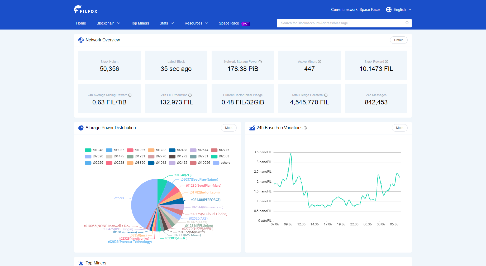

# {{ $frontmatter.title }}

{{ $frontmatter.description }}

[[TOC]]

## 区块浏览器

| Name                                                 | Screenshot                                                                |
| ---------------------------------------------------- | ------------------------------------------------------------------------- |
| [Filscan](https://filscan.io/)                       |    |
| [Filscout](https://filscout.io/)                     |   |
| [Filfox](https://filfox.io/)                         |     |
| [Filplorer](https://filplorer.com/)                  |  |
| [1475 Explorer](https://1475ipfs.com/#/blockBrowser) |   |

## Lotus

一旦您 [使用 Lotus 设置](lotus/README.md) 您可以使用命令行查询有关网络的信息。

获取区块头部:

```sh
lotus chain head
```

打印区块:

```sh
lotus chain getblock <block_cid>
```

打印消息信息:

```sh
lotus chain getmessage <message_cid>
```

有关其他链相关命令检查:

```sh
lotus chain --help
```
