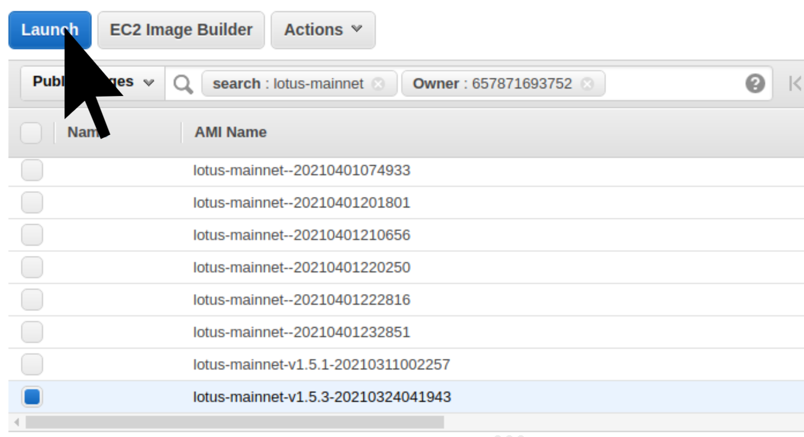

# {{ $frontmatter.title }}

{{ $frontmatter.description }}. 在云提供商上运行 Lotus 是一种快速启动和运行的方式。使用这些映像，您可以在不到半小时的时间内启动并运行一个完全同步的节点，而无需在本地机器上编译 Lotus。

## 云供应商

### DigitalOcean

最简单和最便宜的方式是使用 [DigitalOcean 市场中的一键式应用程序](https://marketplace.digitalocean.com/apps/filecoin-lotus).

<a href="https://marketplace.digitalocean.com/apps/filecoin-lotus" alt="DigitalOcean Logo"></a>

After deploying, log into your new DigitalOcean Droplet as `root` using the password you provided when creating a "Droplet" (virtual machine) with Lotus pre-installed:

```
ssh root@<your_droplet_public_ipv4>
```

#### 使用 DigitalOcean API 部署 Lotus

您还可以通过编程方式启动 Lotus 节点。例如，要在 SFO2 区域创建一个 4 GB 的 filecoin-lotus Droplet，您可以使用以下 curl 命令：

```
curl -X POST -H 'Content-Type: application/json' \
-H 'Authorization: Bearer '$TOKEN'' \
-d '{"name":"a_name","region":"sfo2","size":"s-2vcpu-4gb",
"image":"protocollabs-filecoinlotus-20-04"}'  "https://api.digitalocean.com/v2/droplets"
```

### 亚马逊网络服务

我们定期为每个项目发布 AMI [filecoin 网络](https://network.filecoin.io/). 要使用这些映像之一，只需搜索我们的 AMI 之一。你可以用这个 [在`us-west-2`区域中填充对 Lotus 的搜索的示例链接](https://us-west-2.console.aws.amazon.com/ec2/v2/home?region=us-west-2#Images:visibility=public-images;search=lotus-mainnet;ownerAlias=657871693752;sort=name).

<a href="https://us-west-2.console.aws.amazon.com/ec2/v2/home?region=us-west-2#Images:visibility=public-images;search=lotus-mainnet;ownerAlias=657871693752;sort=name" alt="AWS Logo"></a>



启动 AWS 实例后，您应该使用`ubuntu`帐户登录。
Filecoin 实例运行一个基于主机的防火墙 (UFW)，它阻止所有传入端口，除了
用于端口 22 和 5678 (libp2p)。如果您想将实例置于许可安全组之后，这很有效。

```
ssh ubuntu@<your_instance_public_ipv4>
```

## 使用图像

实例一启动，就会下载一个包含最近 2000 个状态根的大文件。在此期间，lotus API 不会启动，但 lotus 正在工作。大约20分钟后，状态root下载完成，lotus正常启动。这个过程是自动发生的。您无需为 Lotus 启动任何操作。

如果你有兴趣看看发生了什么，你可以在 systemd 日志中查看 lotus 的日志。

(自选的)

```
journalctl -u lotus-daemon
```

当 stateroot 文件正在下载时，systemctl 会将此作业的状态显示为`Activating`。

您会注意到作业尚未开始。不用担心，导入 stateroot 文件后它会转换为活动状态。

```
[mainnet ~] ⨎ systemctl status lotus-daemon

● lotus-daemon.service - Lotus Daemon
   Loaded: loaded (/lib/systemd/system/lotus-daemon.service; disabled; vendor preset: enabled)
   Active: activating (start-pre) since Sat 2021-04-03 01:36:03 UTC; 7s ago
Cntrl PID: 1088 (bash)
    Tasks: 11 (limit: 9513)
   Memory: 600.8M
   CGroup: /system.slice/lotus-daemon.service
           ├─1088 bash /usr/local/bin/lotus-init.sh
           └─1101 lotus daemon --import-snapshot https://fil-chain-snapshots-fallback.s3.amazonaws>


```

大约 20 分钟后，stateroot 快照将完成下载，lotus 将正常启动。

---

**NOTE**
stateroot 下载仅在您的实例最初启动时发生一次。将来可能发生的任何重新启动都不会再次下载 stateroot，因此启动速度会快得多。

---

现在stateroot已经下载成功，可以和lotus网络进行交互了。

```
[mainnet ~] ⨎ lotus net peers
<see current peers here>
```
