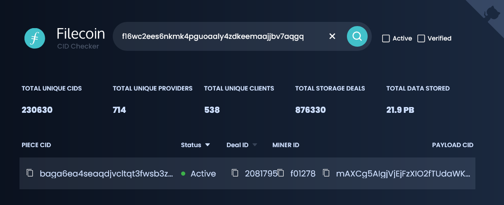
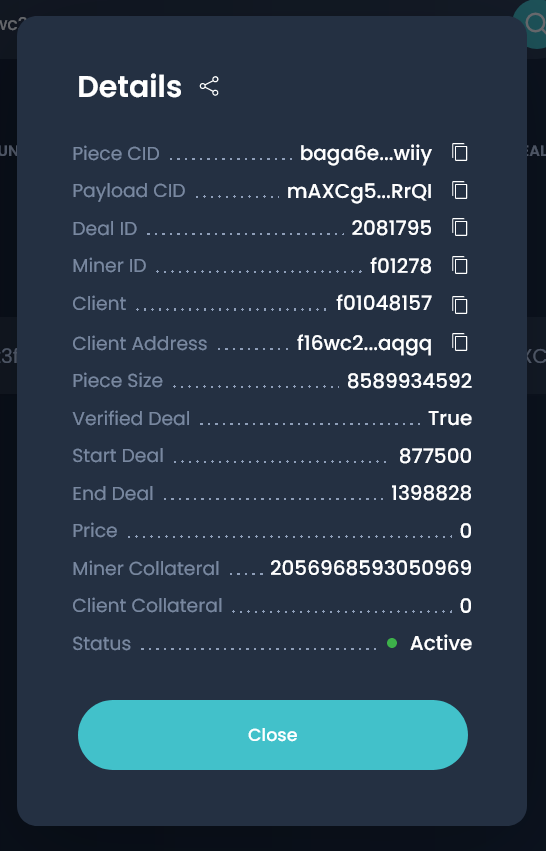

# 检索数据

在上一步中，您在Filecoin网络上存储了一些数据。存储提供商需要长达24小时的时间来密封数据。如果距离你完成最后一部分已经超过24小时了，那太好了!如果没有，也不要担心;您仍然可以通过本页面检索已经在Filecoin网络上的一些示例数据。

##重启Lotus

如果在完成了上一节之后关闭了Lotus或关闭了计算机，则需要重新启动`lotus daemon`。

1. 打开终端窗口。
1. 启动一个Lotus lite-node并连接到`api.chain.love`:

    ```shell
    FULLNODE_API_INFO=wss://api.chain.love lotus daemon --lite
    ```

1. lotus daemon将继续运行。您必须从单独的终端窗口运行进一步的命令。
   接下来是[检查你的余额↓](#检查地址余额)

## 检查地址余额

在可以从存储提供程序检索数据之前，需要检查是否有足够的FIL来支付检索费用。

1. 列出这个Lotus lite节点上的所有地址:

    ```shell
    lotus wallet list
    ```

   Lotus将输出如下内容:

    ```shell
    > Address                                    Balance  Nonce  Default  
    > f16mwizoeloamhp4dea4uy367mlihddw2mflnb5vy  10 FIL   0      X  
    ```

   任何大于0.1 FIL的余额都足以检索我们在本教程中请求的数据。

:::warning 低或无平衡
如果你没有足够的FIL，你需要转一些FIL到这个账户。你可以使用加密货币交易所或让朋友给你发送FIL。地址的f1……'列出的时候你运行'莲花钱包列表'是你的公共地址;当向交易所或你的朋友要钱时，可以使用这个短语。

查看[管理资产部分](.././about-filecoin/management-assets.md)获取关于[从交易所提取filecoin](.././about-filecoin/management-assets.md#exchanges)的信息。

##获取交易信息

在发送检索请求之前，需要收集一些信息来组织命令。你将需要:

|变量|描述|
| --- | --- |
| Miner ID |存储数据的存储提供商的ID。|
| Data CID |该变量有时也称为 _Payload CID_。|
|地址|最初用于创建存储交易的公共地址。|

我们现在就去收集这些信息。

1. 复制这个 **address** 到你的剪贴板:`f16wc2ees6nkmk4pguoaaly4zdkeemaajjbv7aqgq`。

:::tip使用不同的地址
如果您想检索您存储的数据，您可以使用那个 **address** 来代替我们在本教程中使用的那个。如果您想使用本地Lotus笔记上的 **address**，请运行`lotus wallet list`并将其复制到剪贴板。

记住，您将无法检索存储在24小时之前的数据。
:::

2. 去 [filecoin.tools](https://filecoin.tools) .

3.粘贴 **address**在搜索栏，并按`ENTER`搜索由该 **address**做成的交易:

   


   :::warning使用不同的地址
   在本教程中提供的默认**地址** `f16wc2ees…`只提交了一笔存储交易，所以你只能在 [filecoin.tools](https://filecoin.tools/f16wc2ees6nkmk4pguoaaly4zdkeemaajjbv7aqgq) 中看到一行。如果您使用不同的**地址**，您可能会看到多个行。如果您没有看到_any_行，那么您搜索的**地址**尚未完成交易。**地址**可能已经提交了交易，但存储提供商还没有密封数据。交易只有在存储提供商完成数据封存后才会显示在这里。
   :::

4. 点击一行中的任何位置查看具体交易的信息:

   

1. 记下 **Payload CID** 和 **Miner ID**。 在下一步中，您将需要这两个来创建检索命令。

## 发送检索请求

接下来是创建 Lotus 运行的命令。 检索命令的结构是：`lotus clientretrieve --miner <MINER ID> <DATA CID> ~/output-file`

1. 使用上面的模板，创建命令，用您在上一步中获得的变量替换 `<MINER ID>` 和 `<DATA CID>`。 您的命令应如下所示：
2. 
    ```shell
    lotus client retrieve --miner f07709 mAVWg5AIgFw51hfKzfy8nRsKHlMtT8/DPBJhn1f9eFyOSeldlAiE output-file
    ```

   `output-file` 是要保存的文件的名称。你也可以给这个变量添加一个路径:

    ```shell
    lotus client retrieve --miner f0100 mAVW...lAiE ~/Downloads/filecoin-download.tar
    ```

3. 运行该命令。提交此命令后，Lotus lite-node将向存储提供程序发送检索请求并等待响应:

    ```shell
    > Recv: 0 B, Paid 0 FIL, ClientEventOpen (DealStatusNew)
    > Recv: 0 B, Paid 0 FIL, ClientEventDealProposed (DealStatusWaitForAcceptance)
    > Recv: 0 B, Paid 0 FIL, ClientEventDealAccepted (DealStatusAccepted)
    > ...
    ```

4. 等待完成:

    ```shell
    > Recv: 66.33 KiB, Paid 0.00000000000013584 FIL, ClientEventPaymentSent (DealStatusFinalizing)
    > Recv: 66.33 KiB, Paid 0.00000000000013584 FIL, ClientEventComplete (DealStatusFinalizingBlockstore)
    > Recv: 66.33 KiB, Paid 0.00000000000013584 FIL, ClientEventBlockstoreFinalized (DealStatusCompleted)
    Success
    ```

    :::danger 
    必须让`lotus daemon`在该进程期间运行。
    :::

5. 就是这样!

## 下一步

这标志着Filecoin存储和检索教程系列的结束!到目前为止，您应该已经很好地了解了存储和检索过程如何在Filecoin网络上工作，也对如何将这个过程集成到您的项目有一些想法!您可以继续使用Lotus和Filecoin存储和检索数据。如果你需要帮助或陷入困境，请查看[Filecoin Slack](https://filecoin.io/slack/) 寻求帮助。
