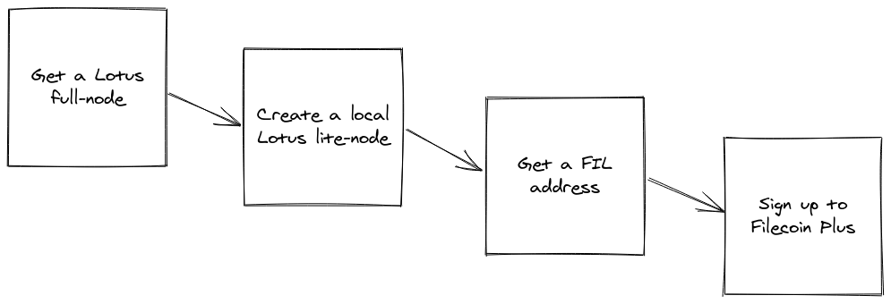

# 安装

在开始在Filecoin网络上存储任何数据之前，需要执行几个步骤来完成所有设置。本节介绍如何访问Lotus全节点、在计算机上创建Lotus lite节点、获取FIL地址和注册Filecoin+。


:::tip 什么是 Lotus?
与Filecoin网络交互的程序称为 _implementations_， [Lotus](../../get-started/lotus)是一个命令行接口(CLI)实现。与Lotus一起创建的还有[其他实现](../../get-started#Filecoin-implementations)，但Lotus是Protocol Labs创建和维护的唯一Filecoin实现。
:::

## 注意事项

当你经历这一节时，记下以下变量:

变量|描述|示例|
| --- | --- | --- |
|您的Filecoin地址|您的Filecoin地址的公开部分。这个地址是其他用户可以用来发送您的FIL的地址. | `f1fwavjcfb32nxbczmh3kgdxhbffqjfsfby2otloi` |

## 访问全节点

Lotus全节点是运行`lotus daemon`的计算机。全节点是唯一的，因为它们可以完全访问Filecoin区块链。运行Lotus全节点所需的计算机规范相对较高，可能超出了大多数终端用户笔记本电脑和pc的能力。

通常，我们必须使用一个完整节点，但在本教程中，我们将使用Protocol Labs提供的Lotus完整节点。这个节点叫做`api.chain.love`只适用于像本教程这样的练习环节，不应该用于任何生产或开发目的。

## 安装一个lite-node

lite节点可以让你的计算机与Filecoin网络交互，而不必运行一个资源密集型的全节点!lite -node可以做一些事情，比如对消息进行签名并与存储提供者进行通信，但是任何需要区块链数据的进程都必须来自一个完整的节点。幸运的是，lite节点会自动将任何基于区块链的请求路由到全节点。对于本教程，您将在本地计算机上运行一个Lotus lite-node，并将其连接到由Protocol Labs管理的全节点。


要在计算机上安装Lotus lite-node，必须拥有从GitHub存储库_build_ Lotus二进制文件所需的工具。

查看[Lotus: install and setup](../lotus/install.md)了解如何在其他操作系统上安装Lotus。

::::: tabs

:::: tab macOS

:::warning 要求
您可以在MacOS 10.11 El Capitan或更高版本上安装Lotus。您必须安装[Homebrew](https://brew.sh/)。
:::

1. 添加 `filecoin-project/lotus` Homebrew tap:

    ```shell
    brew tap filecoin-project/lotus
    ```

1. 安装 Lotus:

    ```shell
    brew install lotus
    ```

1. Lotus现在已经安装在您的计算机上. 

::::
:::: tab Ubuntu

在Ubuntu上安装Lotus有两种简单的方法:

- [AppImage](#appimage)
- [Snap](#snap)

#### AppImage

1. 更新和升级您的系统:

    ```shell
    sudo apt update -y && sudo apt upgrade -y
    ```

1. 从[Lotus GitHub发布页面](https://github.com/filecoin-project/lotus/releases/) 下载最新的`AppImage`文件:

    ```shell
    wget https://github.com/filecoin-project/lotus/releases/download/v1.11.1/Lotus-v1.11.1-x86_64.AppImage
    ```

1. 使' AppImage '可执行:

    ```shell
    chmod +x Lotus-v1.11.1-x86_64.AppImage
    ```

1. 将`AppImage`移动到`/usr/local/bin`目录下，并重命名为`lotus`。

    ```shell
    sudo mv Lotus-v1.11.1-x86_64.AppImage /usr/local/bin/lotus
    ```

[转到下一节，运行Lotus lite节点 ↓](#run-a-lotus-lite-node)

#### Snap

:::warning 要求
你必须安装 [Snapd](https://snapcraft.io/docs/installing-snapd) .
:::

1. 要使用Snap安装Lotus，请运行:

    ```shell
    snap install lotus-filecoin
    ```

[转到下一节，运行Lotus lite节点 ↓](#run-a-lotus-lite-node)


:::::

## 运行Lotus lite-node

现在已经为运行Lotus做好了准备，可以在计算机上启动Lotus lite节点并连接到“api.chain.love”Lotus-full-node !

:::warning
只是提醒一下, `api.chain.love` 是一个由Protocol Labs管理的Lotus全节点。它非常适合在本教程中使用，但不应该在开发或生产环境中使用。
:::

1. 打开一个终端窗口， 使用`lotus daemon --lite` 命令, 使用`api.chain.love` 作为full-node 地址: 

    ```shell with-output
    FULLNODE_API_INFO=wss://api.chain.love lotus daemon --lite
    ```

    ```
    ...
    2021-06-16T02:00:08.390Z        INFO    markets loggers/loggers.go:56   module ready   {"module": "storage client"}
    2021-06-16T02:00:08.392Z        INFO    markets loggers/loggers.go:56   module ready   {"module": "retrieval client"}
    2021-06-16T02:00:18.190Z        INFO    basichost       basic/natmgr.go:91      DiscoverNAT error:no NAT found
    ...
    ```

1. MacOS用户可能会看到关于Lotus的警告。如果看到警告，选择**接受传入连接**。
1. lotus daemon将继续运行。您必须从单独的终端窗口运行进一步的命令。

接下来是[获取FIL地址↓](#get-a-fil-address)

## 获取一个FIL地址

Filecoin地址与普通银行账号类似。其他用户可以使用您的地址向您发送FIL，您也可以使用您的地址向存储提供商支付存储和检索数据的费用。

Filecoin地址由两部分组成:公共地址和私钥。您可以自由地与任何人共享您的公共地址，但绝不应共享您的私钥。在本教程中，我们不打算查看任何私钥，但理解公共地址和私钥之间的区别是至关重要的

1. 打开一个新的终端窗口，并使用`lotus wallet new`命令创建一个地址:

    ```shell with-output
    lotus wallet new 
    ```

    ```
    f1fwavjcfb32nxbczmh3kgdxhbffqjfsfby2otloi
    ```

   Lotus输出您的公共地址。公共地址总是以`f1`开头。

1. 把这个地址记下来。我们将在下一节中使用它。

## 备份你的地址

你的地址由两部分组成:你的_public地址和你的_private密钥。公共地址是您运行`lotus wallet new`时看到的，您可以安全地与任何想要共享该地址的人共享。但是，您的私钥必须保密和安全。如果您丢失了私钥，就失去了对存储在该地址中的任何FIL的访问权。

备份你的地址是非常重要的。在另一台设备上存储一份你的地址副本是确保你不会失去使用资金的好方法。

1. 如果你的公共地址`f1…`，复制到你的剪贴板上。如果不是，列出与Lotus节点关联的地址并复制公共地址:

    ```shell with-output
    lotus wallet list
    ```

    ```
    Address                                    Balance  Nonce  Default  
    f1nau67e6k6ggdwluatfz4waexetjfrqmx6fil3nq  0 FIL    0      X  
    ```

2. 使用`lotus wallet export`导出您的私钥，替换`f1…`的公开密码匙:

    ```shell
    lotus wallet export f1... > my_address.key
    ```

   这将创建一个 `my_address.key` 在当前目录中。.

一旦你有了一个文件，你可以把它复制到另一个驱动器，安全地发送到另一台电脑，甚至打印出来。确保文件的安全很重要。如果Lotus节点发生任何情况，您仍然可以使用此文件访问资金。

## Filecoin Plus

存储提供商的报酬要么是直接从用户那里获得存储他们的数据的FIL，要么是从网络获得区块奖励，或者两者兼而有之!

从用户那里获得付费很简单。如果Laika想要存储一些数据，而Albert是存储提供商，那么他们可以创建一个协议，将Laika的数据存储为`X`时间，存储为`Y`时间。

区块奖励每30秒随机给予存储提供商。存储提供商存储的数据越多，他们赢得区块奖励的机会就越大。因此，如果存储提供商接受用户的交易，存储5gb的数据，他们有5次机会赢得每30秒一轮的区块奖励。

DataCap作为一种 _multiplier_ 块奖励。如果一个存储提供商接受了一个附加了DataCap的用户的交易，也被称为`验证交易`，那么Filecoin网络就会把这个交易当成是它的10倍。所以一个5gb的交易给存储miner50次机会赢得区块奖励，而不是通常的5次机会。一些存储供应商发现DataCap非常有价值，他们愿意在不收取任何FIL的情况下进行验证交易!你可以使用[Filecoin Plus miner registry](https://plus.fil.org/miners/) 找到这些存储提供商的列表。

### 注册

注册Filecoin Plus是简单和免费的!

:::tip
你需要一个至少180天的GitHub账户。如果你没有一个足够老的GitHub账户，[与Filecoin Slack的团队联系](https://filecoin.io/slack/) 。
:::

1. 访问[plus.fil.org](https://plus.fil.org) 。
1. 在**For isClients**下，单击**Proceed**。
1. 在**Get verified**下，点击**Get verified**。
1. 点击**Automatic Verification**.
1. 点击GitHub图标旁边的**Start**。
1. 在 `Request` 字段中，输入运行`lotus wallet list`得到的公共地址。这个步骤可能需要几分钟才能完成。

##下一步

现在我们已经完成了所有设置，我们可以进入[使用Filecoin网络存储数据→](./store-data.md)

