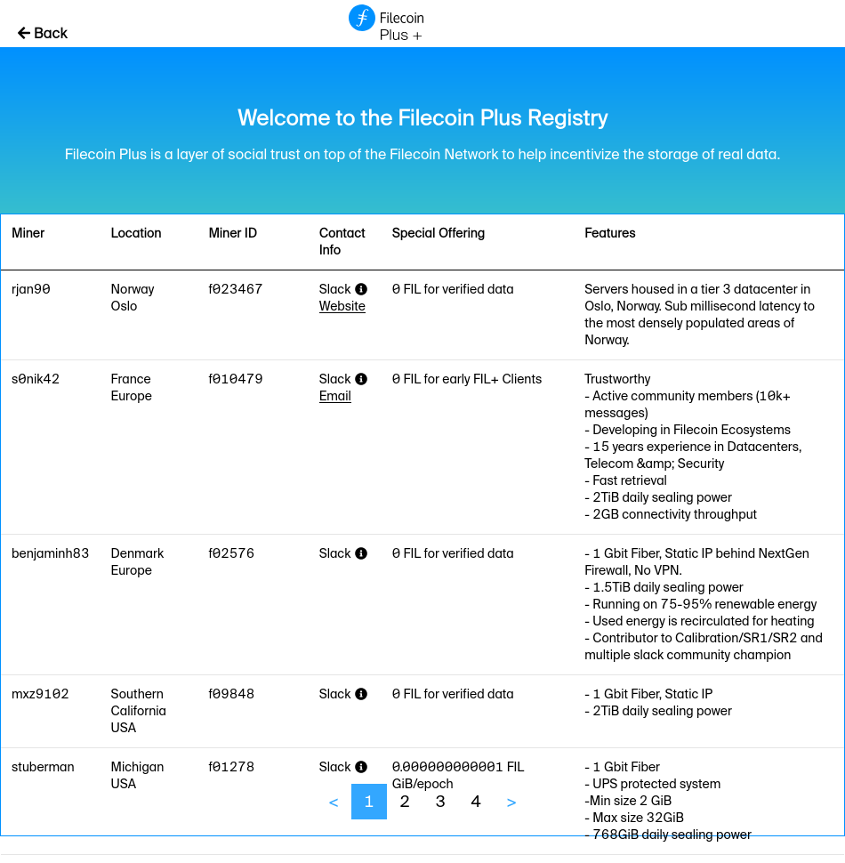
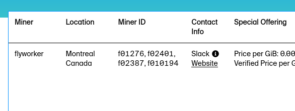
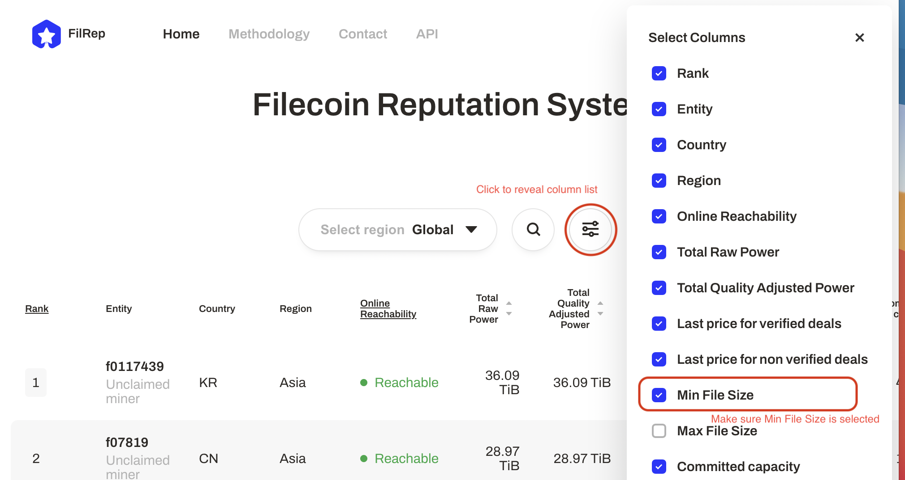
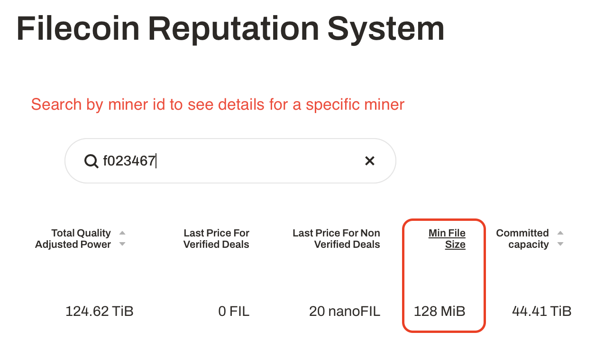

# 存储数据

开始在Filecoin网络上存储您的数据。本节介绍打包数据、将其导入本地Lotus lite节点、通过Filecoin Plus miner注册表找到存储提供商、创建存储交易，然后等待交易完成!

:::danger
Filecoin针对公共数据进行了优化，目前还不支持访问控制。如果存储私有数据，请确保在存储之前对其进行加密，以确保没有解密能力的人无法读取该数据。请记住，如果在未来的任何时刻发现加密过程中的漏洞，那么您的数据可能会受到损害。
:::

## 需要注意的事情

当你经历这一节时，记下以下变量:

|变量|描述|示例|
| --- | --- | --- |
| Data CID |使用Filecoin存储的数据的CID (content identifier)。| |“bafk2bzaceajz56zudni2hli7id6jvvpo5n4wj5eoxm5xwj2ipthwc2pkgowwu”
| Miner ID #1 |每个存储提供者的唯一标识符。对于本教程，您需要有两个存储提供程序id。|“f01000”
| Miner ID #2 |每个存储提供者的唯一标识符。对于本教程，您需要有两个存储提供程序id。|“f01000”
| Deal CID |与存储提供商交易的内容标识符(CID)。| |“bafyreict2zhkbwy2arri3jgthk2jyznck47umvpqis3hc5oclvskwpteau”

## 准备您的数据

在本教程中，我们将创建一个充满随机数据的虚拟5GB文件，并将其存储在Filecoin网络上。

1. 移动到你的主文件夹:

    ```shell
    cd ~
    ```

1. 创建一个5GB的随机数据块作为我们的有效负载:

    **MacOS** 用户必须执行:

    ```shell
    dd if=/dev/urandom of=5gb-filecoin-payload.bin bs=1m count=5200
    ```

    **Linux** 用户必须执行: 

    ```shell
    dd if=/dev/urandom of=5gb-filecoin-payload.bin bs=1M count=5200
    ```

   这个过程大约需要60秒来创建一个虚拟文件。

现在，我们已经准备好使用Filecoin网络存储有效负载文件了。

## 向Lotus添加数据

我们需要告诉Lotus lite节点要使用Filecoin存储哪个文件。

1. 使用'import'命令将有效负载导入到' lotus daemon '中:

    ```shell
    lotus client import 5gb-filecoin-payload.bin 
    ```

    Lotus根据有效负载创建一个有向无环图(DAG)。这个过程需要几分钟。完成之后，Lotus将输出有效负载CID。

    ```text output
    Import 3, Root bafykb...
    ```

   这个过程大约需要60秒。

1. 记下CID ' bafykb…'。这是您的**数据CID**。我们将在下一节中使用它。

现在Lotus知道了我们想要使用哪个文件，我们可以与Filecoin存储提供商创建一个协议来存储我们的数据!

## 查找存储提供程序

在存储数据之前，我们需要找到合适的存储提供商。Filecoin网络允许存储提供商通过提供不同的定价条款、可接受的数据大小和其他重要交易参数来竞争。考虑存储提供商的位置也很重要;存储提供商离您越近，存储和检索过程就会越快。

我们将使用Filecoin Plus miner注册表来找到几个存储提供商，然后与第三方存储提供商信誉系统交叉检查他们的信息。

:::tip
增加您使用的存储提供商的数量会增加数据冗余，并降低数据丢失的几率。
:::

### Filecoin Plus Miner 注册表

Filecoin Plus Miner注册是一组地理上不同的存储提供商的集合，他们愿意接受用户提供的低成本或免费存储交易。在世界不同地区提供存储服务的存储提供商越多，我们就能越快地实现Filecoin存储人类最重要信息的潜在使命。查看[Filecoin Plus页面](../../store/ Filecoin - Plus .md)以了解更多关于该程序的信息。

让我们找几个存储提供商来存储我们的数据。

1. 去(plus.fil.org/miners) (https://plus.fil.org/miners/)。
1. 使用这个表，找到几个适合您需要的存储提供程序。尝试寻找地理位置上离你很近的存储提供商
1. 一旦你找到了一些合适的存储提供商，从**Miner ID**列记下他们的_miner IDs_:

    

   一些存储提供商列出多个minerid。对于这些存储提供者，只需复制其中一个id:

    

1. 请务必写下您想要使用的存储提供者的id。我们将在下一节中引用这些id。

### Miner 声誉系统

Filecoin Plusminer注册表是一个很棒的资源，但它只代表整个Filecoinminer社区的一小部分。像[FilRep](https://filrep.io)这样的Filecoin信誉系统可以帮助你根据存储供应商过去的表现比较它们，并提供有关存储供应商将接受的交易参数的有用信息。使用FilRep，您可以比较存储提供商的指标，如位置、网络中的存储能力、定价和总体成功率。

我们将使用FilRep检查我们选择的存储提供商的最小交易大小是否适合我们的文件大小。

1. 去(filrep.io) (https://filrep.io)。
1. 单击**Settings**切换显示所有可用存储提供程序详细信息的列表。
1. 确保选中了**最小文件大小**列:

    

1. 现在可以使用miner ID搜索之前找到的存储提供程序。 

    

1. 检查最小文件大小小于5gib，并且他们对已验证的交易收取0 FIL费用。
1. 如果你的存储提供商显示的最小文件大小大于5 GiB，或者他们对已验证的交易收取的费用大于0 FIL，返回[上一节](#filecoin-plus-miner-registry)并选择一个新的存储提供商。

现在你已经找到了你的miner，你可以开始创建一个存储交易了!

## 达成协议

要完成本节，您需要运行“lotus客户端导入”后收到的**Data CID**和希望使用的存储提供程序的id。

1. 启动互动交易流程:

    ```shell
    lotus client deal
    ```

   互动交易助理现在会问你一些问题。

1. 指定要在Filecoin上备份的有效载荷的CID。这是运行“lotus client import ~/5gb-filecoin-payload.bin”得到的CID:

    ```text output
    Data CID (from lotus client import): bafykbz...
    ```

1. 等待Lotus完成负载大小的计算。Lotus通过计算负载中的单个位来计算这个大小，以确保大小是准确的。 

    ```text output
    .. calculating data size 
    ```

   这个过程的持续时间取决于文件的大小和Lotus节点的规格。在测试中，Lotus使用4核CPU和8GB RAM生成一个7.5GB左右的文件，耗时约20分钟。这些规格对于大多数终端用户的笔记本电脑很常见。

1. 输入您希望在Filecoin上保存此文件的天数。最少180天:

    ```text output
    Deal duration (days): 180 0
    ``` 

1. 告诉Lotus这是不是一个Filecoin Plus交易。因为你在之前的步骤中注册了Filecoin Plus，在这里选择“yes”:

    ```text output
    Make this a verified deal? (yes/no): yes
    ```

1. 输入上一节的minerid，并用空格分隔两个id:

    ```text output
    Miner Addresses (f0.. f0..), none to find: f01000 f01001 
    ```

1. 输入“yes”确认您的交易:

    ```text output
    -----
    Proposing from f136b5uqa73jni2rr745d3nek4uw6qiy6b6zmmvcq
            Balance: 2 FIL
    
    Piece size: 8GiB (Payload size: 7.445GiB)
    Duration: 7200h0m0s
    Total price: ~0 FIL (0 FIL per epoch)
    Verified: true
    
    Accept (yes/no): yes
    ```

1. Lotus将返回两个**交易cid **:

    ```text output
    .. executing
    Deal (f01000) CID: bafyreict2zhkbwy2arri3jgthk2jyznck47umvpqis3hc5oclvskwpteau
    Deal (f01001) CID: bafeauyreict2zhkbwy2arri3jgthk2jyznck47umvpqis3hc5oclvskwpt
    ```

1. 记下这笔交易cid ' baf…'。

## 查看交易状态

一旦数据被发送到存储客户端，存储交易可能需要24小时才能完成。你可以查看交易的进展情况。

1. 使用' lotus client List -deals '命令列出成功的和等待的交易:

    ```shell
    lotus client list-deals --show-failed
    ```

    :::danger DO NOT TURN OFF YOUR LOTUS NODE 
    Your Lotus lite-node needs to remain online until the deal state has reached `StorageDealActive`. See the [Processing states](#processing-states) table below to find out which states happen and when. 
    :::

1. 你可以通过运行“lotus client list-transfers”来检查任何数据传输的进度:

    ```shell
    lotus client list-transfers
    ```

   这个命令将输出如下内容:

    ```text output
    Sending Channels
    ID                   Status   Sending To   Root Cid     Initiated?  Transferred  Voucher                                   
    1620782601911586915  Ongoing  ...KPFTTwY7  ...zyd3kapm  Y           224.1MiB     ...bqhcidjmajbelhlxfqry3d7qlu3tvar45a"}}  

    Receiving Channels
    ...
    ```

   如果' lotus client list-transfers '的输出为空，那么您的传输已经完成:

    ```shell with-output
    lotus client list-transfers
    ```
    ```
    Sending Channels
    
    
    Receiving Channels
    
    
    ```

### 交易状态

由于Lotus和Filecoin网络的复杂性，交易可能处于许多不同的状态。

#### 处理状态

下表是交易应该进入的状态列表，假设没有错误。这个列表是按时间顺序排列的，从交易第一次创建到成功完成:

|状态|描述|
| --- | --- |
| StorageDealUnknown |交易的当前状态为未定义或未知。这可能是因为您的全节点不同步。|
| StorageDealReserveClientFunds |客户端正在检查是否有足够的FIL来完成交易
| StorageDealClientFunding |客户端已将资金存入StorageMarketActor，并等待资金出现。|
| StorageDealFundsReserved |您的FIL已存入托管，可以用于支付交易。|
| StorageDealStartDataTransfer |存储提供程序已经准备好接受来自客户端Lotus节点的数据。|
| storagedealtransferred |数据正在从客户端Lotus节点传输到存储提供程序。|
| StorageDealCheckForAcceptance |客户端正在等待存储提供商签署并发布交易。|
| StorageDealProposalAccepted |存储提供商拟接受存储交易提案;但是，存储提供程序目前还没有作出任何这样做的承诺。|
| StorageDealAwaitingPreCommit |交易已经准备好了，必须被预提交。|
| storagedealseal |存储提供商正在将数据密封到扇区中。您的数据负载越大，这将花费更长的时间。|
| StorageDealActive |数据在一个密封扇区中，存储提供商可以将数据返回给您。|
| StorageDealExpired  |一笔交易已经度过了它的最后一个时代。存储提供商仍然可以使用数据，但没有义务向任何人提供。|

#### 错误状态

按字母顺序排列，下面的协议表明，在这方式上有个失败的地方:

|状态|描述|
| --- | --- |
| StorageDealError |有一个不可预见的错误。不会有进一步的更新。|
| StorageDealFailing |一笔交易出了问题。一旦数据清理完毕，交易就完成了。|
| StorageDealProposalNotFound |您的全节点无法找到您正在寻找的交易。这可能是因为它不存在，或者您的全节点不同步。|
| StorageDealProposalRejected|存储提供商选择不接受该交易。存储提供者可能在此状态消息旁边提供了原因，但并不总是如此。|
| StorageDealRejecting | 存储提供商拒绝了该交易。这在StorageDealProposalRejected之前。|
| StorageDealSlashed |数据在一个扇区中，存储提供商因为未能证明数据是可用的而被削减。|

#### 信息状态

下面的交易状态只是信息，并不意味着交易失败。这个列表是按字母顺序排列的:

|状态|描述|
| --- | --- |
| storagedealacceptwwait |存储提供商正在运行自定义决策逻辑来决定是否接受交易。在定制逻辑做出决定之前，该交易将保持此状态。|
| StorageDealClientTransferRestart |从客户端到存储提供商的存储交易数据传输在暂停后重新启动，可能是由StorageDealProviderTransferAwaitRestart引起的。|
| StorageDealFinalizing |所有数据都在扇区内，存储提供者正在执行最后的检查，以确保所有数据都是正确的。|
| StorageDealProviderFunding |存储提供商已将资金存入StorageMarketActor，并等待资金出现。|
| StorageDealProviderTransferAwaitRestart |当数据从客户端传输到存储提供程序时，存储提供程序重新启动。一旦存储提供者恢复在线，它将等待客户机恢复传输。|
| StorageDealPublish |该交易已准备好在链上发布。|
| StorageDealPublishing | 该交易已经发布，但尚未在链上出现。|
| StorageDealReserveProviderFunds |存储提供商正在检查是否有足够的FIL来完成交易。|
| storagedealstaging |该交易已经发布，数据已经准备好放入一个扇区。此时，存储提供商已经完全致力于存储您的数据。|
| storagedealvalididating |存储提供程序正在验证交易参数是否适合提议。|
| StorageDealVerifyData |所有数据已经传输完毕，存储提供者现在正尝试根据PieceCID验证它。|
| StorageDealWaitingForData |是否发生了手动传输，或者存储提供者没有收到来自客户端的数据传输请求。|

这些状态来自[Lotus项目GitHub库](https://github.com/filecoin-project/go-fil-markets/blob/master/storagemarket/dealstatus.go).

## 下一个步骤

现在你已经在Filecoin网络上添加了一些数据[我们可以移动到检索数据→](./retrieve-data.md)
