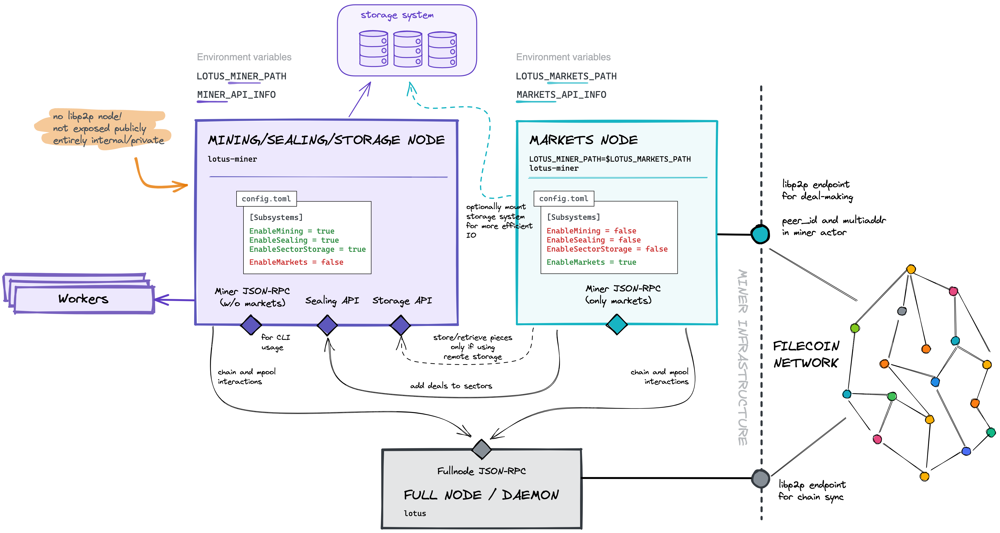

# {{ $frontmatter.title }}

{{ $frontmatter.description }}

[[TOC]]

## 概念

Lotus 执行挖矿操作，例如将文件密封到扇区中，计算证明 这些文件并在链上提交证明。
Lotus 还执行市场运营，为客户提供存储和检索服务。

现在可以在不同的进程中运行 miner 和 markets子系统。 服务提供者可以接受存储和检索交易而不影响正在进行的挖掘操作。 市场的过程通过JSON-RPC与挖掘进程通信。

强烈建议在独立的物理或虚拟机上运行挖掘和市场流程，以便:  
- 机器硬件可以根据流程的典型工作量进行定位  
- 只有运行市场进程的机器才会公开公共端口

然而，在同一台机器上分别运行这些进程仍然是有利的 隔离它们——例如存储服务提供商可以停止和重启markets 过程而不影响矿机上正在进行的 Winning PoSt和Window PoSt。

以下步骤将指导您完成备份Miner节点的过程，创建 全新Markets节点的初始配置，禁用市场功能 在挖矿节点上，并使Miner和Markets节点都在线。

## 架构

下图总结了miner/market分离的架构部署:



正如您所看到的，只有markets和fullnode/daemon运行libp2p主机向互联网公开公共端口。  mining/sealing/proving 节点保留完全私有的。 这提供了保护并降低了操作风险。

市场节点通过sealing和storage API 与 mining/sealing/storage 节点对话，主要用于传递来自存储交易的密封件，以及获取用于检索的件。
Market节点通过密封与 mining/sealing/storage 节点进行对话和存储api，主要用于从存储中分离出用于密封的部件交易，以及取件服务取回。

市场和挖掘/密封/存储节点都需要访问守护进程的JSON-RPC端点，以便查询链和状态树，以及通过池将消息推送到网络。

如下所示，`lotus`和`lotus-miner`CLI命令需要访问所有json-rpc端点。 记住，JSON-RPC端点是私有的，而不是私有的公开暴露(除非您操作一个公共的fullnode或网关节点!)

另一个值得一提的方面是，市场和通过配置 mining/sealing/storage 节点，实现存储系统的共享(磁盘阵列或文件系统)，当它们运行在相同的系统上时，它们可以在本地运行机器，或者在单独的机器上运行时作为网络挂载。 这个设置支持更有效的访问，减少网络IO负载。

## 将`lotus-miner`整体拆分为子系统

::: tip
该特性在lotus v1.11.1及以上版本中可用。
:::

本文档解释了如何将现有的单个`lotus-miner`节点分割为多个进程，以利用这种新架构。

### 配置

Lotus v1.11.1在`Lotus-miner`进程中引入了`子系统`的概念。
目前有 4 个子系统可以在 `config.toml` 文件中启用或禁用：

```toml
[Subsystems]
#  EnableMining = true
#  EnableSealing = true
#  EnableSectorStorage = true
#  EnableMarkets = true
```

这些选项默认设置为`true`，你在此设置下运行一个`lotus-miner`。 到目前为止，单一的`lotus-miner`流程  
负责所有的功能。

`subsystems` 可以在每个节点自己的配置文件中每个进程单独启用和禁用。 目前只支持两种组合:

1. `markets` 节点 - 一个负责处理存储市场的 `lotus-miner` 进程
   子系统，以及与服务存储和检索交易相关的所有功能；

```toml
[Subsystems]
  EnableMining = false
  EnableSealing = false
  EnableSectorStorage = false
  EnableMarkets = true
```

2. `mining/sealing/proving`节点——负责Filecoin挖掘的`lotus-miner`流程，
   扇区储存、密封、验证;

```toml
[Subsystems]
  EnableMining = true
  EnableSealing = true
  EnableSectorStorage = true
  EnableMarkets = false
```

当一个 `lotus-miner` 实例被配置为一个 `markets` 节点时，它会暴露一个 libp2p 接口。 libp2p 端口应该是公开可用的，以便希望进行存储和检索交易的客户可以拨打该节点。

本指南不会详细介绍如何使端点可连接，因为这最终取决于您的网络基础设施和设备，请参阅 [lotus-miner 连接指南](https://docs.filecoin.io/mine/lotus/connectivity/#frontmatter-title) 了解更多详情。 一般来说，除了调整可能存在的任何防火墙之外，在面向外部的路由器上配置静态端口映射并确保您的市场节点具有内部静态 IP 地址和端口应该就足够了。

::: tip  
当`lotus-miner`实例被配置为`mining/sealing/proving`节点时，它不接受请求，不应该在互联网上公开曝光。  
**`market`节点通过它与`mining/sealing/proving`节点进行通信JSON RPC接口。** 重申一下，`mining/sealing/proving`不再运行libp2p接口，`market`和`mining/sealing/proving`不再通过libp2p通信，而是通过HTTP和/或Websockets (JSON-RPC接口)。  
:::

## 分割市场过程

### 准备和备份

在将Market与单一miner流程分开之前，我们需要**备份**miner的元数据存储库。 停止`lotus daemon`和`lotus-miner`然后使用环境变量`LOTUS_BACKUP_BASE_PATH`重新启动它们:

::: tip
在本指南中，我们替换了`/tmp`文件夹中的备份文件，因为它是一个临时文件，只是用来初始化Market节点，以后不会用到它。  
:::

1. 在机器上运行的全节点:

```shell
lotus daemon stop
export LOTUS_BACKUP_BASE_PATH=/tmp
```
2. 在机器上运行的miner节点:

```shell
lotus-miner stop
export LOTUS_BACKUP_BASE_PATH=/tmp
```

3. 重新启动守护进程和lotus-miner
4. 在运行miner节点的机器上创建备份

```shell
lotus-miner backup /tmp/backup.cbor
```

### 细分market子系统

#### 步骤 1. 为时长服务创建一个种子 "config.toml"

为了初始化Market，我们需要为Market节点创建一个种子 “config.toml”
注意:这是一个临时文件，仅用于初始化Market节点，初始化时将自动加载完整的配置文件**，**不覆盖本步骤设置的节点。

首先创建一个'config. Toml '文件放在您选择的位置(您的Market节点需要有权限读取它)，在本教程中，我们将把它放在您的市场机器的' /tmp '目录中，因为它是一个临时文件)

启用market子系统，并将[lotus miner configuration](https://docs.filecoin.io/mine/lotus/miner-configuration/#api-section)中与市场进程相关的会话添加到' /tmp/config.toml '中。  

如果你打算在同一台机器上运行`mining/sealing/proving`节点`markets`节点，确保它们的 `[API]` 侦听器地址**不冲突**。默认情况下，`lotus-miner`API服务器监听端口2345，在本例中就是这样配置上面的`markets`过程，我们改变配置`markets`节点API服务器监听 `127.0.0.1:8787` 。

确保你调整了`markets`节点上的` [Libp2p] `部分- **它需要可以公开访问，以便客户机可以进行存储和检索处理你的系统


::: tip
如果您以前运行的是lotus miner monolith进程, 从`~/.lotusminer/config.toml`中复制`Dealmaking`会话。来保存您的配置! 如果您想用默认的交易撮合配置初始化Market节点，可以跳过本部分。  
:::


```toml
[Subsystems]
  EnableMining = false
  EnableSealing = false
  EnableSectorStorage = false
  EnableMarkets = true

[API]
  # 市场流程将为JSON-RPC请求提供服务的端点 
  ListenAddress = "/ip4/127.0.0.1/tcp/8787/http"
  RemoteListenAddress = "127.0.0.1:8787"

[Libp2p]
  # libp2p请求端点(公共)
  ListenAddresses = ["/ip4/0.0.0.0/tcp/24001", "/ip6/::/tcp/24001"]
  AnnounceAddresses = ["/ip4/12.34.56.78/tcp/24001"]

[Dealmaking]
  # 当启用时，miner可以接受在线交易  
  ConsiderOnlineStorageDeals = true
  # 当启用时，miner可以接受离线交易 
  ConsiderOfflineStorageDeals = true
  # 当启用时，miner可以接受检索交易
  ConsiderOnlineRetrievalDeals = true
  # 当启用时，miner可以接受离线检索交易  
  ConsiderOfflineRetrievalDeals = true
  # 当启用时，miner可以接受验证交易
  ConsiderVerifiedStorageDeals = true
  # 当启用时，miner可以接受未经验证的交易
  ConsiderUnverifiedStorageDeals = true
  # 在进行交易时要拒绝的数据cid列表
  PieceCidBlocklist = []
  # 最大的预期时间将使交易进入一个封闭的领域将需要
  # 这包括交易转移和公布所需的时间
  # 在被分配到某个区域之前
  # 要了解更多信息，请参见下面。
  ExpectedSealDuration = "24h0m0s"
  # 当一笔交易准备发布时，等待的时间就更多了 
  # 交易要准备好发布之前，所有作为同一批发布
  PublishMsgPeriod = "1h0m0s"
  # 最大数量的交易包括在一个单一的发布交易消息
  MaxDealsPerPublishMsg = 8
  # 用于对存储交易进行细粒度评估的命令(见下面) 
  Filter = "/absolute/path/to/storage_filter_program"
  # 用于对检索交易进行细粒度评估的命令(见下面)
  RetrievalFilter = "/absolute/path/to/retrieval_filter_program"
```

::: info
“采矿/密封/验证”节点上`config.Toml`的`[Libp2p]`部分
可以删除，因为它将不再运行Libp2p节点，如上所述。  
:::

#### 步骤 2. 在`mining/sealing/proving`miner过程中禁用market子系统

1. 在你的`mining/sealing/proving`机器上，更新你的`~/.lotusminer/config.toml`。 将`EnableMarkets`选项设置为`false`  .

```toml
[Subsystems]
  EnableMining = true
  EnableSealing = true
  EnableSectorStorage = true
  EnableMarkets = false
```

#### 步骤 3. 初始化`markets`服务存储库

1. 为Market节点创建身份验证令牌，`markets`节点将使用它们来创建JSON-RPC  
   调用`mining/sealing/proving`节点。

```shell
export APISEALER=`lotus-miner auth api-info --perm=admin`
export APISECTORINDEX=`lotus-miner auth api-info --perm=admin`
```

2. 初始化`markets`节点。 这将执行Market节点的一次性设置。这个设置的一部分包括通过提交更新miner角色中的“peer id”链上的消息。 这是必要的，以便存储和检索客户机知道这一点这个miner的**交易**终端现在可以在一个新的地址(新的`markets`节点)。

::: warning
在执行以下步骤之前，请确保您的主挖掘进程正在运行。
:::

对于本教程，我们将使用~/。 作为市场存储库路径的Lotusmarkets。 您不需要预先手动创建该文件夹。

```shell
lotus-miner --markets-repo=~/.lotusmarkets init service --type=markets \
                                                        --api-sealer=$APISEALER \
                                                        --api-sector-index=$APISECTORINDEX \
                                                        --config=/tmp/config.toml \
                                                        /tmp/backup.cbor
```

3. 如果在这个过程中，你最终改变了`markets`的“multiaddr”  
   进程到不同的主机和/或端口，你必须更新链上miner的multiaddr '。  
   否则，客户希望与你的交易将不再能够连接你的节点。

::: tip
在您的Market节点，onchain上的`multiaddr`应该与`config.toml`中` Libp2p `部分中设置的`ListenAddresses`相同。  
:::

```shell
lotus-miner actor set-addrs <NEW_MULTIADDR>
```

4. 在完成`markets`节点存储库的初始化之后，必须重新启动`mining/sealing/proving`节点，以使配置更改生效。

#### Step 4. 在Market节点上考虑配置storage.json 

如果你有 [定制的存储位置](https://docs.filecoin.io/mine/lotus/custom-storage-layout/#frontmatter-title)
对于你的monolithminer，考虑以下两种情况:
1. 如果miner和市场运行在同一台机器上  
   访问相同的路径,复制的`~/.lotusminer/storage.Json `文件到` ~/.lotusmarket `  
   目录.
2. 如果两个进程运行在不同的机器上，则使用miner调整的`~/.lotusmarket/storege.Json`指向共享的网络挂载.

这将使`markets`程序直接从这些位置，而不是流它们到/通过miner节点减少网络IO负载

#### 步骤 5. **可选**:将DAG存储目录移动到Market节点存储库

如果你已经初始化了dagstore，你可以选择移动DAG store  
目录到lotus markets存储库中，以保留已有的索引  
已经建立了。

::: tip
在v1.11.1中还没有引入Dagstore，一旦它在Lotus中可用，我们将更新文档。
:::

```shell
mv ~/.lotusminer/dagstore ~/.lotusmarkets/
```

#### 步骤 6. 用market子系统启动`markets`miner流程

启动` markets `节点，使用环境变量` LOTUS_MINER_PATH `指向` markets `节点repo。

请注意，`lotus-miner run`与`markets`或`mining/sealing/proving`存储库交互  
取决于‘LOTUS_MINER_PATH’环境变量!

```shell
LOTUS_MINER_PATH=~/.lotusmarkets lotus-miner run
```

就是这样，你已经成功地建立了你的market子系统! 


## Calling commands

根据发出的命令，`lotus-miner`CLI命令已经被重构为针对正确的子系统节点。 例如:

1.  如果你叫`lotus-miner storage-deals list`，那么`lotus-miner`*知道*如何瞄准`markets`过程。
2.  如果你调用`lotus-miner sectors list `， `lotus-miner` *知道*以 `mining/seal/proving`过程为目标。

### 环境变量

In 添加 [现有的环境变量](https://docs.filecoin.io/mine/lotus/miner-setup/#checklist-before-launch) 给 `lotus-miner`, `MARKETS_API_INFO` 和 `LOTUS_MARKETS_PATH` 为market子系统引入:
- `LOTUS_MARKETS_PATH` 是您的市场存储库的位置。
- `MARKETS_API_INFO` 是Market节点的位置。

::: tip
您可以学习如何使用不同的lotus节点[这里](https://docs.filecoin.io/mine/lotus/miner-lifecycle/#using-a-different-lotus-node).
:::

当拆分miner和market子系统时，我们**建议**添加`.bashrc`，并为您的Market节点提供API地址/路径。 例如，您可以混合和匹配运行markets节点的机器内部的配置:

```
FULLNODE_API_INFO=...
MINER_API_INFO=...
LOTUS_MARKETS_PATH=...
```

运行`mining/sealing/proving`或`lotus-worker`节点的机器内部的客户端配置，希望与Market节点和整个节点交互:

```
FULLNODE_API_INFO=...
MINER_API_INFO=...
MARKETS_API_INFO=...
LOTUS_MINER_PATH=...
LOTUS_MARKETS_PATH=...
```

远程与所有节点通信的客户端配置:

```
FULLNODE_API_INFO=...
MINER_API_INFO=...
MARKETS_API_INFO=...
```

### 与其他流程的Market节点进行交互

对于所有`lotus-miner `进程中都存在的命令，默认情况下CLI的目标是` mining/seal/proving`进程，但是您可以通过'--call-on-markets '标志明确地将目标定位于`markets`进程。 例如，`log`和`auth`命令就是这样。

为了利用这一功能，您应该在运行命令文件中为`mining/seal/proving` miner(或lotus-worker)和` markets `miner配置以下环境变量

```shell
export LOTUS_MARKETS_PATH=~/.lotusmarkets
export LOTUS_MINER_PATH=~/.lotusminer
```

如果这些节点之一在一个**远程**机器上，你应该设置相关的API_INFO环境变量，如下所示:

```shell
# <market_api_token> 从属于 $LOTUS_MINER_PATH/token
export MARKETS_API_INFO=<market_api_token>/ip4/<lotus_miner_market_node_ip>/tcp/<lotus_miner_market_node_port>/http

# <miner_api_token> 从属于 $LOTUS_MINER_PATH/token
export MINER_API_INFO=<miner_api_token>:/ip4/<lotus_miner_node_ip>/tcp/<lotus_miner_node_port>/http
```

现在，你已经有了一个`markets`miner进程和一个`mining/seal/proving` miner进程在运行，你可以通过以下步骤确认你可以与每个进程交互:

1. 获取miner信息
```shell
lotus-miner info
```

1. 获得`markets`miner过程的同行身份
```shell
lotus-miner --call-on-markets net id
```

2. 从`markets`miner流程中获取存储交易列表
```shell
lotus-miner storage-deals list
```

3. 从`mining/seal/proving` miner过程中获得一个扇区列表
```shell
lotus-miner sectors list
```

## 退回到单进程`lotus-miner`

如果您想恢复上面列出的更改，并返回作为单个进程运行 `lotus-miner`，请运行以下命令:

1. 关闭“采矿/密封/检验”和`markets`节点。
   
2. 确保`mining/sealing/proving`节点公开，因为我们将在其上启用market子系统。 在`~/$LOTUS_MINER_PATH/config.toml`的[`Libp2p`节(https://docs.filecoin.io/mine/lotus/miner-configuration/#libp2p-section)中设置地址

3. 在`mining/sealing/proving`存储库中，更新`配置`。 并将`EnableMarkets`选项设置为`true`
```toml
[Subsystems]
  EnableMining = true
  EnableSealing = true
  EnableSectorStorage = true
  EnableMarkets = true
```

4. **可选**:如果你之前已经初始化了dagstore，那么移动回DAG存储目录到monolithminer节点存储库:

```shell
mv ~/.lotusmarkets/dagStore ~/$LOTUS_MINER_PATH/
```

5. 从`markets`实例备份并恢复与存储交易相关的元数据到monolith miner实例。 如果你在运行多服务架构时接受了存储交易，那么存储交易元数据将在`markets`实例上发生变化，我们必须将它复制回monolith miner实例。

如果你之前没有这样做过，那就构建`lotus-shed`二进制文件:
```shell
make lotus-shed
```
然后运行

```shell
lotus-shed market export-datastore --repo ~/.lotusmarkets --backup-dir /tmp/deals-backup

lotus-shed market import-datastore --repo ~/$LOTUS_MINER_PATH --backup-path /tmp/deals-backup/markets.datastore.backup
```

6. 重启`mining/sealing/proving`节点(使用默认的LOTUS_MINER_PATH，它应该指向您的`mining/sealing/proving`节点repo)。 注意，`LOTUS_MINER_PATH` 环境变量决定了`LOTUS_MINER_PATH`与给定的存储库交互!

```shell
lotus-miner run
```

7. 获取节点标识。 这是必要的，因为您必须更新链上的minerpeer身份，因为它在Market存储库初始化期间被更改为Market节点的身份。

```shell
lotus-miner net id
```

8. 用上一步的结果更新miner的peer id和链上的multiaddr。

```shell
lotus-miner actor set-peer-id 12D3XXXXX
```

一旦消息被确认，客户端将知道查找您的`mining/sealing/proving`节点的节点标识，该节点现在也运行`markets`子系统，即当前所有Lotus子系统。

现在在你的“采矿/密封/证明”节点上，链上的`multiaddr`应该与config.toml中`Libp2p`设置的`ListenAddresses`相同。

```shell
lotus-miner actor set-addrs <NEW_MULTIADDR>
```

9. 更新市场`config.toml`的`Addresses`部分，与`mining/sealing/proving`节点相同。

```toml
[Addresses]  
    PreCommitControl = ["f00XX1"]  
    CommitControl = ["f00XX2"]  
    TerminateControl = []  
    DealPublishControl = ["f00XX3"] 
    DisableOwnerFallback = false  
    DisableWorkerFallback = false 
```

通常，如果您初始化Market节点从 `config.toml` 用于`mining/sealing/proving`节点，本节设置与`mining/sealing/proving`节点相同。 如果您已经在运行一个子系统，并且已经更改了该区域的配置，请将更改复制到Market节点。 如果不复制更改，`DealPublishControl`配置将不受影响，`DealPublish`成本将从worker钱包中扣除。
