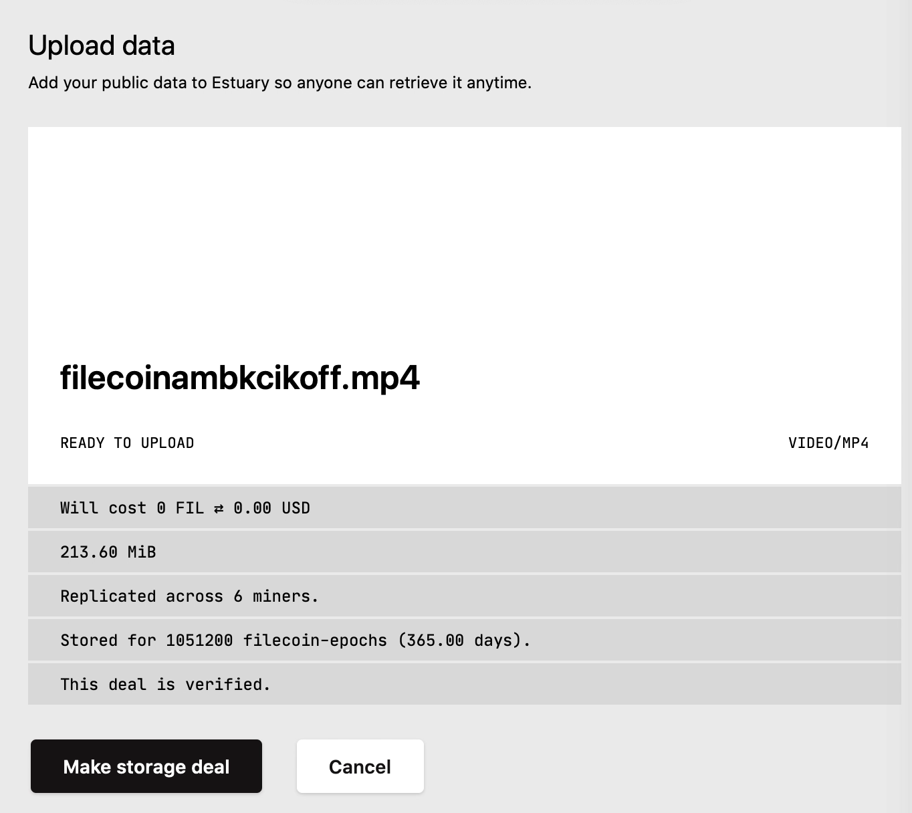
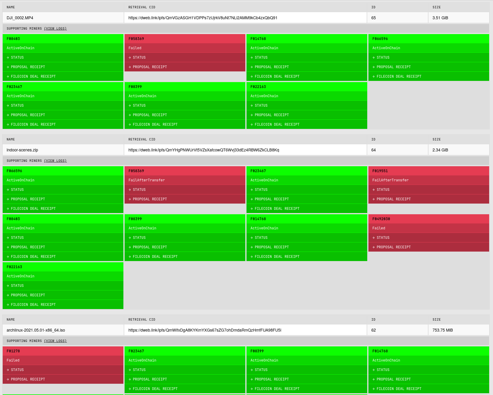
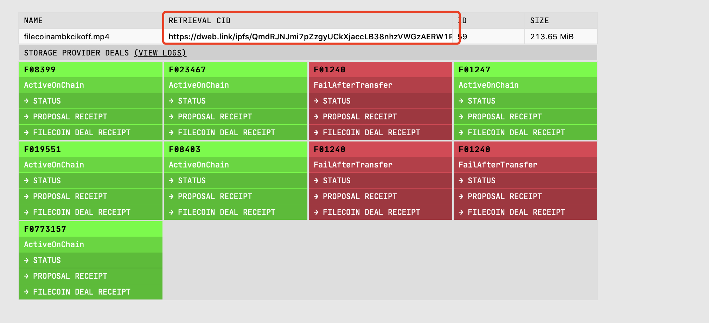

# {{ $frontmatter.title }}

{{ $frontmatter.description }}

[Estuary](https://estuary.tech) 使用Filecoin自动化存储活动。 在其核心，Estuary是一个简单的IPFS节点，集成了最小的Filecoin客户端库。 它是一个由[ARG](https://arg.protocol.ai/)创建的开源项目，可以在[github.com/application-research/estuary](https://github.com/application-research/estuary)上找到。  

对于想要在Filecoin上存储数据的开发者和用户来说，Estuary是一个很好的解决方案。 请参阅[Estuary文档](https://docs.estuary.tech)了解更多关于该项目的信息。

## 在Filecoin上存储数据

如果您想快速上传任何将托管在IPFS上并存储在Filecoin网络上的数据:

1. 登录 [Estuary.tech](https://estuary.tech).
2. 从侧边栏菜单选择**交易** .
3. 点击**上传数据**并选择您想要上传的文件并创建存储交易。 一旦文件成功上传，Estuary将输出在Filecoin网络上存储数据的成本，格式为[FIL](https://docs.filecoin.io/reference/glossary/#fil)和美元，数据的大小，存储文件的存储提供商的数量， 存储时间和交易是否得到验证(https://spec.filecoin.io/#section-algorithms.verified_clients)。  

   

4. 如果你的文件大于3.57Gib，点击**进行存储交易**，然后Estuary将首先在IPFS上托管文件，并尝试与六个存储供应商进行存储交易! 要检查您的交易信息，选择**交易**从侧边栏菜单。

    

5. 如果您的数据小于3.57Gib，它将首先托管在IPFS上，并放置在“Staging Zone”中。 几小时后，Filecoin Network将会达成一项存储协议。

## 检索您的数据

一旦交易创建，您的数据就可以检索。 只需到您的交易页面通过选择**交易**从侧边栏菜单，找到您想要检索的文件，单击“检索CID”下的链接，您将在任何时刻获得数据!

   

::: tip
您的数据是可检索的，即使它在_Staging Zone_! 只需从侧边栏菜单中选择**Staging**，并单击“retrieve CID”下的链接来获取您的数据!  
:::

## 附加资源

- [Estuary Github 仓库](https://github.com/application-research/estuary)
- [Estuary 文档](https://docs.estuary.tech)
- [构建Estuary](https://docs.filecoin.io/build/estuary/)
- [示例应用程序建立Estuary](https://github.com/application-research/estuary-www)
- [什么是ARG](https://arg.protocol.ai)

