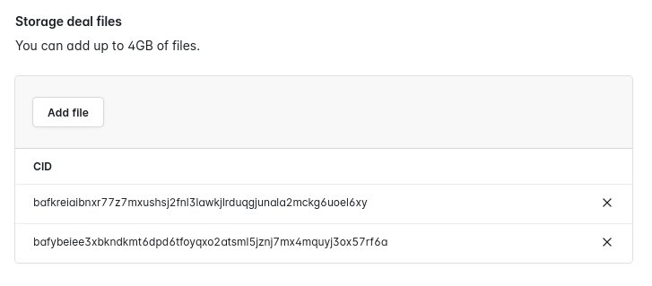
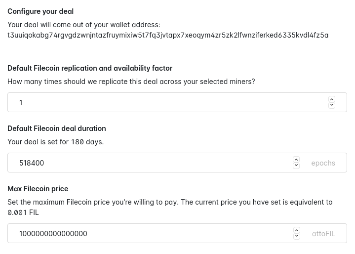

# {{ $frontmatter.title }}

{{ $frontmatter.description }} 它是第一个旨在鼓励跨分布式网络进行协作和研究的开源文件存储应用程序。Slate 的创建是迈向建立一个开放的，适用于所有人的，由 IPFS，Filecoin 和 Textile 支持的，用于数据存储和交易的蓬勃发展的网络的第一步

你可以在[slate.host](https://slate.host)尝试 Slate。早期会员可获得 50GB 的免费存储空间！

## 创建一次性存储交易

如果你想快速上传一些数据到 Filecoin 网络，而不是首先将其托管在 IPFS 上，你可以直接通过 Slate 创建一次性存储交易。

1. 登录[slate.host](https://slate.host/)。
1. 从侧边栏选择 **存储交易** 。
1. 在 **存储交易文件** 下，单击 **添加文件** ，选择需要创建存储交易的文件。对于添加的每个文件，Slate 将输出一个 CID。

   

1. 您可以进一步配置您的交易，以改变复制因子，交易持续时间和最大 Filecoin 价格等事情。更改这些值是可选的，默认值对于大多数用户来说很可能就足够了。

   

1. 如果要加密数据，请选中**加密此存储**框。如果不勾选此选项，**您上传的文件将可供任何具有 cid 的人使用**。如果要共享所选的文件，请不要选中此复选框。
1. 最后，点击**进行存储交易**指示 Slate 尝试进行存储交易。一个警告框确认您的交易成功。

   

#### 包括或忽略特定的miner

如果你有一个特定的miner，你想发送你的请求，你可以通过点击**miner**下的**添加miner**输入他们的miner ID。Slate 将试图首先与这里列出的miner达成交易。如果 Slate 不能与你选择的miner达成交易，它将尝试与网络上的其他miner达成交易。到 **Filecoin** > **miner** 查看信任miner名单。

同样，您可以指定不希望创建交易的miner。为要忽略的每个miner输入miner id。Slate 不会试图与这些miner达成任何存储协议。

## 其他资源

- [Github 仓库地址](https://github.com/filecoin-project/slate)
- [Slate 系统设计文档](https://slate.host/_/system)
- [Slate 系统设计存储库](https://github.com/filecoin-project/slate-react-system)
- [Slate: 一个基于 Textile 的 Powergate 和 Buckets 的研究平台](https://www.youtube.com/watch?v=FJjPMKRy8xQ)
- [Slate 是如何运行的](https://www.youtube.com/watch?v=FJjPMKRy8xQ) (video)
- [将 Slate API 与 IPFS 和 Filecoin 一起使用](https://www.youtube.com/watch?v=Rknj2GqvJtg) (video)
- [Twitter](https://twitter.com/_slate)
- [Textile](https://textile.io)
